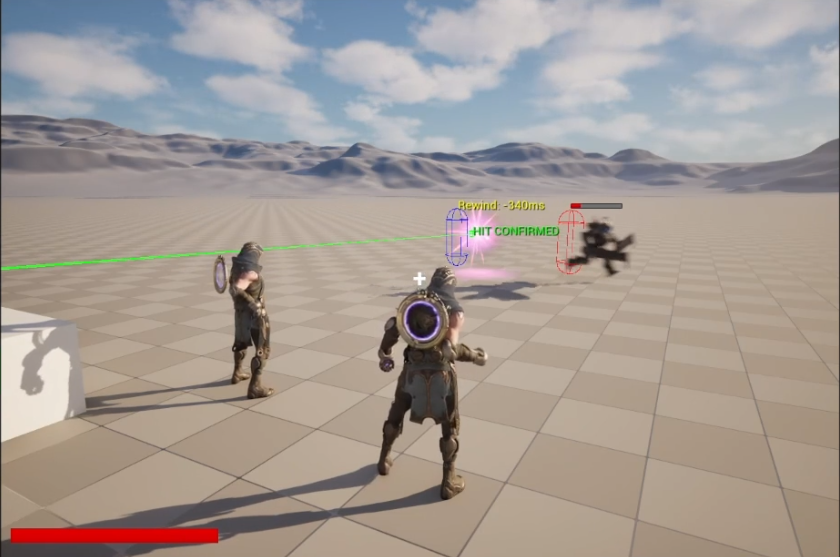
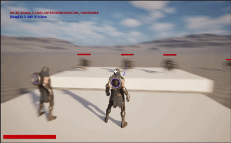
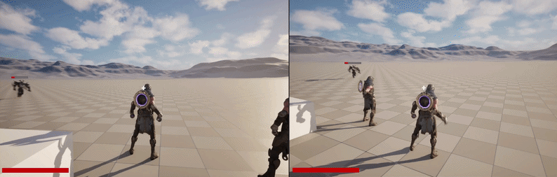
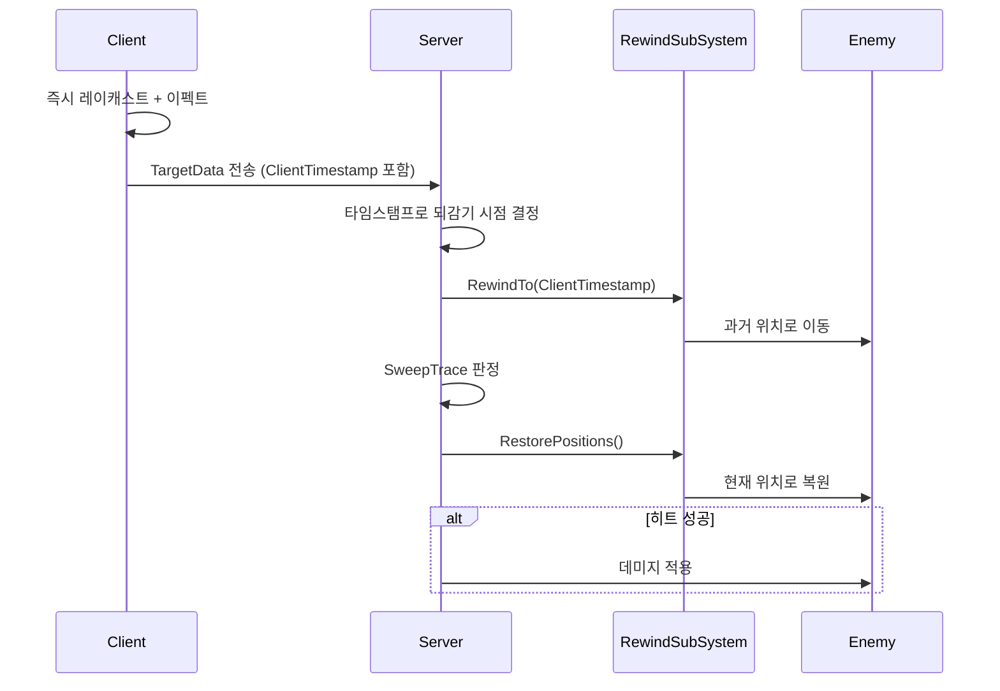
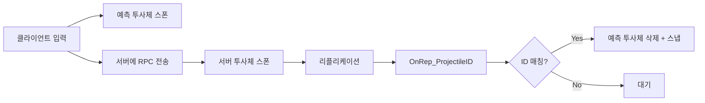

# GAS 네트워크 기술 데모


> 3가지 어빌리티가 각각 다른 네트워크 기법을 시연하는 기술 데모

<!-- 📸 메인 게임 스크린샷 -->


**[시연 영상 보기](https://youtu.be/mm4SxMKc5q0)**

---

## 프로젝트 소개

Unreal Engine 5.6 + GAS(Gameplay Ability System) 기반 멀티플레이어 네트워크 기술 데모입니다. 300ms 고핑 환경에서도 **즉각적인 스킬 반응**과 **공정한 히트 판정**을 구현했습니다.

- **개발 기간**: 2025.01 ~ 2025.02
- **개발 인원**: 1인 개발
- **Unreal Engine**: 5.6

---

## 핵심 기술

| 어빌리티 | 네트워크 기법 | 핵심 포인트                  |
|----------|-------------|-------------------------|
| 투사체 | 클라이언트 예측 + 서버 권위 | ProjectileID 매칭, 스냅 보정  |
| 광역 스킬 (AoE) | Seed 기반 결정론적 동기화 | GameplayCue 1회로 N개 이펙트, 판정 동기화 |
| 히트스캔 | Server Rewind 히트 판정 | 타임스탬프 기반 되감기 + SweepTrace 검증 |

### 네트워크 구조

```
      [Listen Server]
     (Game Authority)
            ↓↑
    ┌───────┴───────┐
    ↓               ↓
[Client A]     [Client B]
```

---

## 어빌리티별 시연

### 1. 투사체 - 클라이언트 예측

<!-- 📸 투사체 시연 스크린샷/GIF -->


**문제**: 고핑 환경에서 투사체 발사 시 지연 발생  
**해결**: 클라이언트에서 즉시 예측 투사체 스폰, 서버 확정 시 매칭하여 스냅 보정

```cpp
// 클라이언트: 예측 투사체 (충돌 비활성화, 시각적 전용)
void AGNPProjectile::InitAsPredicted(int32 InProjectileID)
{
    ProjectileID = InProjectileID;
    PredictionState = EProjectilePredictionState::Predicted;
    SetActorEnableCollision(false);  // 충돌 비활성화
}

// 서버 투사체 도착 시: ID 매칭 → 예측 투사체 삭제
void AGNPProjectile::OnRep_ProjectileID()
{
    if (AGNPProjectile* Predicted = FindPredictedProjectile(ProjectileID))
    {
        // 서버 투사체를 예측 위치로 스냅
        SetActorLocation(Predicted->GetActorLocation());
        Predicted->Destroy();
    }
}
```

**결과**: Net PktLag=300 환경에서도 즉시 발사 느낌 유지

---

### 2. 광역 스킬 (AoE) - Seed 기반 결정론적 동기화

<!-- 📸 광역 스킬 시연 스크린샷/GIF -->


**문제**: N개 이펙트 × 개별 GameplayCue 호출 = 네트워크 과부하
**해결**: Seed 하나로 서버/클라이언트가 동일한 위치 + 타이밍 계산

**핵심 구조 - 가상 투사체 패턴**:
```
┌─────────────────────────────────────────────────────┐
│  실제 투사체 Actor 스폰 없음 (리플리케이션 0개)       │
├─────────────────────────────────────────────────────┤
│  [시각적] GameplayCue → 나이아가라 시스템 1개 스폰   │
│          Location/Delay 배열 전달 → Scratch Pad 활용 │
│  [판정] FTimerManager + ImpactDelay 순차 AoE 데미지  │
└─────────────────────────────────────────────────────┘
```

```cpp
// Seed 기반 결정론적 좌표 + 낙하 시간 계산
TArray<FMeteorImpactData> UGNPMeteorFunctionLibrary::CalculateMeteorImpacts(
    int32 Seed, FVector CenterLocation, int32 Count)
{
    FRandomStream RandomStream(Seed);  // 동일 Seed = 동일 결과
    
    for (int32 i = 0; i < Count; i++)
    {
        // 위치 계산
        float Angle = RandomStream.FRand() * 360.f;
        float Distance = RandomStream.FRandRange(50.f, 500.f);
        
        // 물리 기반 낙하 시간 계산 (랜덤 시작 높이 → 지형)
        float StartHeight = RandomStream.FRandRange(800.f, 1200.f);
        float ImpactDelay = FMath::Sqrt(2.f * StartHeight / Gravity);
        
        ImpactData.Add({Location, ImpactDelay});
    }
    return ImpactDataArray;
}

// C++ FTimerManager로 순차 판정 
void UGNPGameplayAbility_Meteor::ScheduleDamage(const TArray<FMeteorImpactData>& Impacts)
{
    for (const auto& Impact : Impacts)
    {
        FTimerHandle Handle;
        GetWorld()->GetTimerManager().SetTimer(Handle, 
            [this, Location = Impact.Location]() {
                ApplyAoEDamage(Location, DamageRadius);
            }, 
            Impact.ImpactDelay, false);
    }
}
```

**네트워크 최적화 결과**:
- GameplayCue 호출: N회 → **1회**
- 리플리케이트 Actor: **0개** (가상 투사체)
- 나이아가라: N개 시스템 → **1개 시스템** (배열 전달 + Scratch Pad)

---

### 3. 히트스캔 - Server Rewind

<!-- 📸 히트스캔 시연 스크린샷/GIF -->


**문제**: 고핑 환경에서 클라이언트 화면의 적 위치 ≠ 서버 실제 위치  
**해결**: 서버가 클라이언트의 발사 시점 타임스탬프를 기준으로 되감아 판정

```cpp
// 서버: 타임스탬프 기반 되감기 후 판정
void UGNPGameplayAbility_Hitscan::ServerValidateAndApplyDamage()
{
    // 클라이언트가 보낸 발사 시점 타임스탬프 사용
    float RewindTime = TargetData->ClientTimestamp;
    
    // 모든 적을 해당 시점으로 되감기
    RewindSubSystem->RewindTo(RewindTime);
    
    // 되감긴 위치에서 SweepTrace 실행
    bool bHit = GetWorld()->SweepSingleByChannel(...);
    
    // 원래 위치로 복원
    RewindSubSystem->RestorePositions();
    
    if (bHit) ApplyDamage(HitResult);
}
```

**결과**: 300ms 지연 환경에서도 공정한 히트 판정

---

## 시스템 아키텍처

### Server Rewind 흐름



### 투사체 예측 흐름



---

## 기술 스택

### 개발 환경
- **엔진**: Unreal Engine 5.6
- **언어**: C++ (Core Logic) + Blueprint (UI/Content)

### GAS (Gameplay Ability System)
- UGNPGameplayAbility (LocalPredicted, InstancedPerActor)
- UGNPAttributeSet (Health, MaxHealth, Mana, MaxMana)
- GameplayEffect / GameplayCue
- AbilityTask + TargetActor (광역 스킬 타겟팅)

### 네트워킹
- Listen Server 아키텍처
- RPC (Server/Client/Multicast)
- Property Replication (Conditional)
- Custom NetSerialize (투사체 ID, 히트스캔 TargetData)
- Server Rewind System (UWorldSubsystem)

### 설계 패턴
- Server Authority 패턴
- Client-Side Prediction
- Deterministic Synchronization (Seed 기반)
- Component 기반 설계

---

## 프로젝트 구조

```
Source/GASNetworkDemo/
├── Characters/
│   ├── GNPCharacter              # 플레이어 캐릭터 + ASC
│   └── GNPEnemy                  # 적 (Rewind 대상, 순찰 AI)
├── Abilities/
│   ├── GNPGameplayAbility        # 베이스 어빌리티
│   ├── GNPGameplayAbility_Meteor # 광역 스킬 (Seed 기반)
│   └── GNPGameplayAbility_Hitscan # 히트스캔 (Server Rewind)
├── Projectile/
│   └── GNPProjectile             # 투사체 (클라이언트 예측)
├── Network/
│   ├── GNPRewindSubSystem        # Server Rewind 시스템
│   └── GNPMeteorFunctionLibrary  # Seed 기반 좌표 계산
├── GAS/
│   ├── GNPAttributeSet           # 어트리뷰트
│   └── GNPAbilitySystemComponent # ASC
└── Targeting/
    └── MeteorTargetActor         # 광역 스킬 타겟팅
```

---

## 설치 및 실행

### 필요 조건
- Unreal Engine 5.6 이상 (source build)
- Visual Studio 2022 (Windows)
- Git

### 개발 환경 설정

```bash
# 1. 저장소 클론
git clone https://github.com/minsforgh/gas-network-demo
cd gas-network-demo

# 2. .uproject 파일 우클릭
# → "Generate Visual Studio project files" 선택

# 3. Visual Studio에서 솔루션 열기
# → 빌드 (Ctrl+Shift+B)
```

### 멀티플레이어 테스트

**에디터에서 테스트**
1. 에디터 상단 **Play** 버튼 옆 드롭다운 클릭
2. **Number of Players**: 2 이상 설정
3. **Net Mode**: Play As Listen Server
4. **Play** 클릭

**고핑 환경 시뮬레이션**
```
콘솔 명령: Net PktLag=300
```

### 디버그 시각화

```
GNP.ShowRewindDebug 1      # Server Rewind 디버그
GNP.ShowProjectileDebug 1  # 투사체 예측 경로
GNP.ShowHitscanDebug 1     # 히트스캔 트레이스
GNP.DebugMode 1            # 전체 디버그 + Net PktLag=300
```

---

## 트러블슈팅 & 기술 결정

### 1. Server Rewind: Ping/2로 계산했더니 이동 중인 적이 빗나가는 문제

**문제**: Rewind를 도입했는데도 이동 중인 적을 조준하면 빗나감

**원인**: 되감기 시간을 `Ping/2000` (HalfRTT)으로 계산

Ping은 왕복 시간이므로 편도인 HalfRTT만 보상하면 된다고 판단했는데,
클라이언트 화면 자체가 이미 HalfRTT만큼 과거를 보고 있다는 점이 핵심이었다:

```
[클라이언트가 보는 화면]  =  HalfRTT 전의 서버 상태
[클라이언트 → 서버 전송]  =  +HalfRTT

→ 서버가 되감아야 할 총 시간 = HalfRTT + HalfRTT = FullRTT
```

**해결**: FullRTT를 보상하는 두 가지 방식을 모두 구현했다

- **Ping 기반** (`Ping/1000`): FullRTT를 명시적으로 계산
- **타임스탬프 기반** (`ClientTimestamp`): `GetServerWorldTimeSeconds()`가 클라이언트에서 항상 HalfRTT 뒤처진 값을 반환하므로 `ServerNow - ClientTimestamp ≈ FullRTT`가 자동 반영됨

`GNP.RewindMode` CVar로 런타임 전환하며 비교 검증했다.
두 방식 모두 300ms 환경에서 정상 동작함을 확인했다.
(Ping 기반: 310ms 되감기 / 타임스탬프 기반: 333ms 되감기)

---

### 2. 대량 이펙트 동기화 시 클라이언트 누락

**문제**: 서버에서는 N개 이펙트가 모두 표시되지만 클라이언트에서 일부 누락

**원인**: UE의 `MaxRPCPerNetUpdate` 제한 (기본값: 2)
```
이펙트 N개에 대해 GameplayCue를 각각 호출
→ 단일 프레임에 GameplayCue N회 발생
→ MaxRPCPerNetUpdate(기본 2) 초과분은 해당 프레임에서 드롭
→ 클라이언트 이펙트 누락
```

**해결 방향 결정**: 제한값을 늘리는 대신 설계 전환
```
단순 해결: MaxRPCPerNetUpdate 값을 N 이상으로 올리기
    문제: 다수의 클라이언트가 동시에 사용 시 네트워크 부하 폭증

근본적 해결: N개 위치를 직접 전송하는 대신
            Seed 하나로 서버/클라이언트가 동일하게 계산
```

```cpp
// Before: 이펙트 N개 각각 GameplayCue 호출 → 내부 Multicast N회 발생
for (const FMeteorImpactData& Impact : Impacts)
    ExecuteGameplayCueWithParams(Impact.Location, ...);

// After: Seed + CenterLocation만 1회 전달 → 양쪽에서 동일하게 N개 계산
ExecuteGameplayCueWithParams(Seed, CenterLocation);
```

**결과**: GameplayCue 호출 N회 → **1회**

---

### 3. 투사체 스냅 시 깜빡임/뒤로 당겨짐

**문제**: 서버 투사체가 예측 위치로 스냅될 때 시각적 결함

**원인**: Replicated Movement + 로컬 위치 설정 충돌
```
1. SetActorLocation(예측 위치)  → 로컬에서 앞으로 이동
2. 다음 틱 리플리케이션 도착    → 서버 위치(뒤)로 덮어씀
3. 반복 → 깜빡임
```

**해결**:
```cpp
void AGNPProjectile::OnRep_ProjectileID()
{
    if (AGNPProjectile* Predicted = FindPredictedProjectile(ProjectileID))
    {
        // 리플리케이션 비활성화 → 서버가 더 이상 위치 덮어쓰지 않음
        SetReplicateMovement(false);
        
        // 예측 투사체의 위치 + 속도 복사
        SetActorLocation(Predicted->GetActorLocation());
        ProjectileMovement->Velocity = Predicted->ProjectileMovement->Velocity;
        
        Predicted->Destroy();
    }
}
```

**결과**: 스냅 시 깜빡임/뒤로 당겨짐 현상 제거

---

## 개발 하이라이트

### 네트워크 최적화
- **Seed 기반 동기화**: N개 이펙트를 GameplayCue 1회로 완벽 동기화
- **Custom Serialization**: 필요한 데이터만 전송
- **조건부 리플리케이션**: 불필요한 데이터 전송 차단

### 고핑 환경 대응
- **클라이언트 예측**: 지연 없는 즉각적 반응
- **Server Rewind**: 공정한 히트 판정
- **풀 RTT 보정**: 클라이언트 뷰 지연까지 고려

### GAS 활용
- **LocalPredicted**: 클라이언트 예측 + 서버 확정 자동화
- **AbilityTask**: 비동기 타겟팅 처리
- **GameplayCue**: 이펙트 자동 동기화

---

## 사용 에셋

- Paragon: Gideon (캐릭터)
- Paragon: Minions (적)

---

## 라이선스

이 프로젝트는 학습 목적으로 제작되었습니다.

---

## 연락처

- **GitHub**: [@minsforgh](https://github.com/minsforgh)
- **Email**: minsfor@gmail.com
